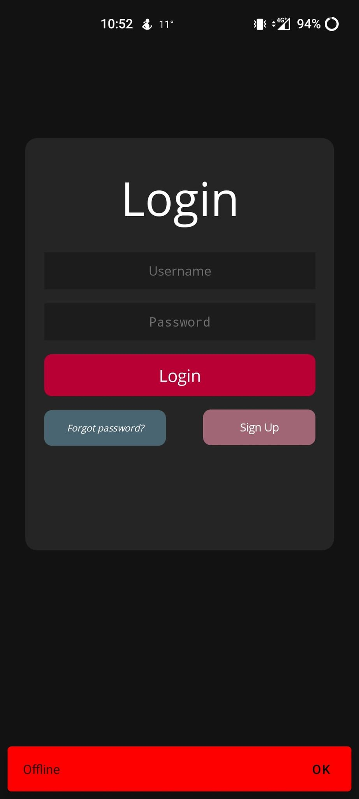
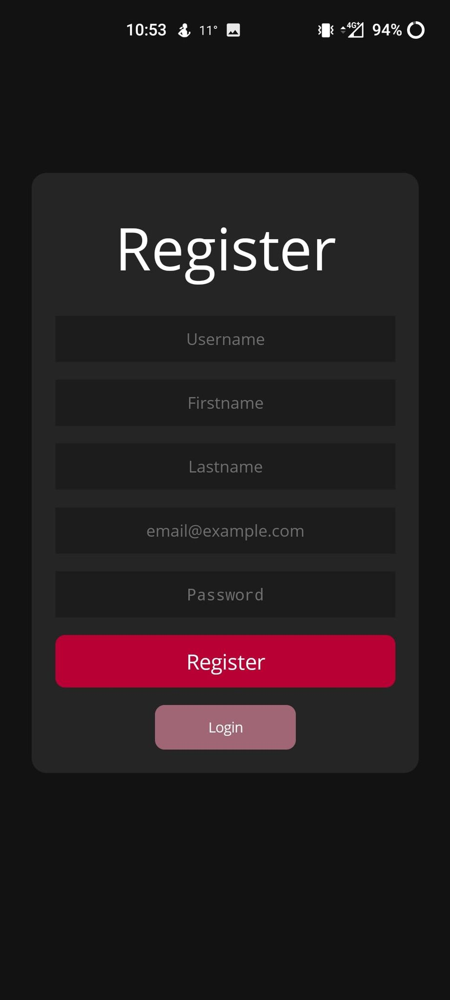
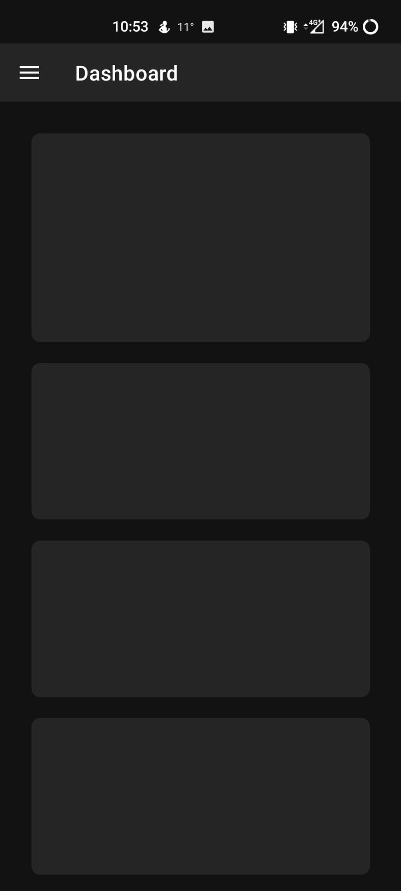
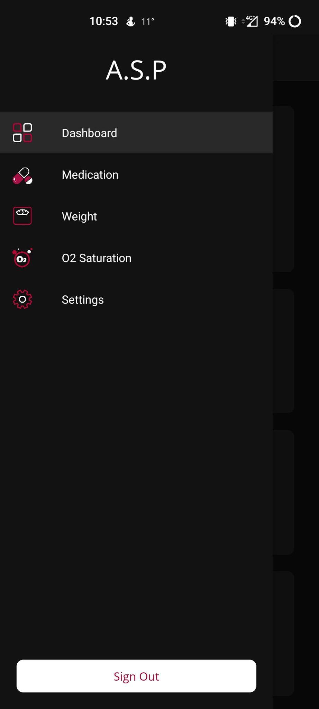
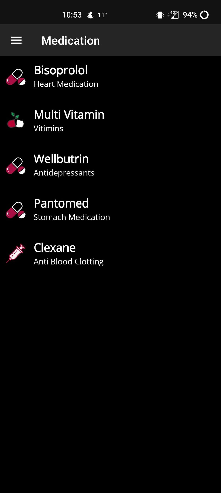
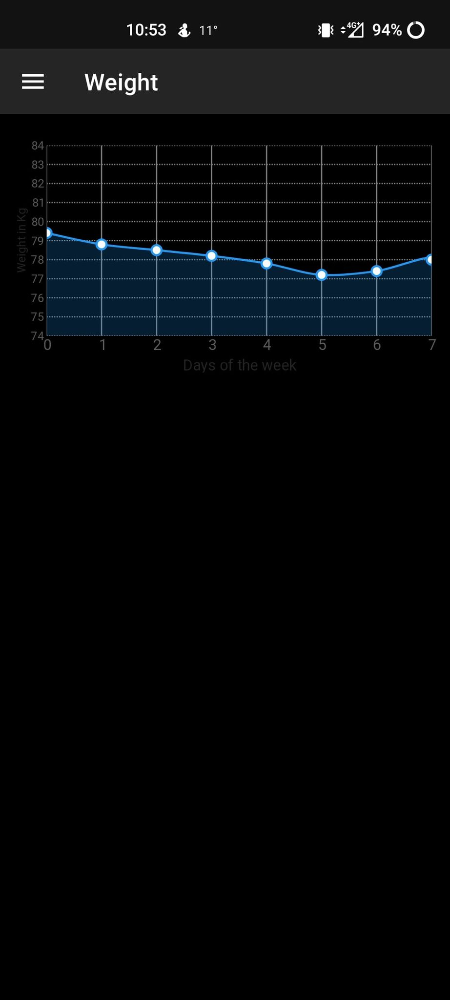
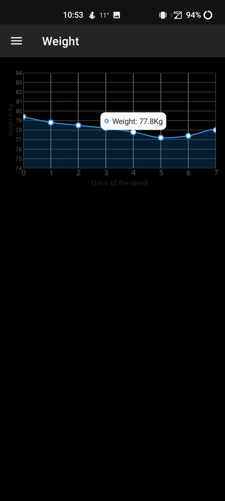
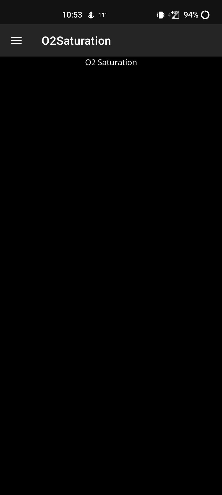
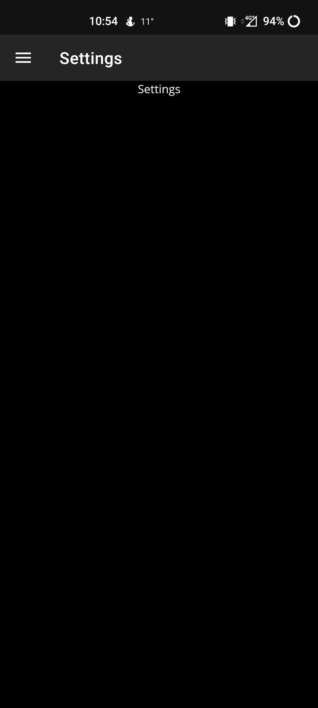

# PE opdracht C# Mobile 2022-2023

Welkom in jouw persoonlijke github pagina voor de PE van het vak C# Mobile. 

### Stef Wouters (12100187@student.pxl.be)

## Opdracht 1 
Zorg dat je deze repository op je computer plaatst en start een nieuw Visual Studio project in de map. 
Denk eraan om deze map niet te diep nesten op je computer (dus niet C:\Documenten\school\2021-2022\CMobile\Week4\Oefeningen\OefeningPE\PEfolder\...). Maak dus een map aan rechtstreeks op je C-schijf of in een map die niet te diep genest is op je computer.

## Opdracht 2
In deze PE worden **minstens 3 commits met een zinvolle message** verwacht. Gebruik voor het committen de commandline of een tool (zoals Github Desktop https://desktop.github.com/), maak **geen** gebruik van de 'upload file' mogelijkheid op github.com.

Probeer de commit messages in het Engels te schrijven en zoek op internet een bron die uitlegt hoe je een goede commit message schrijft (liefst een andere dan uit de les). **voeg deze bron toe onderaan**!

## Opdracht 3
In deze PE is het de bedoeling om een simpele MAUI-applicatie te bouwen en deze op deze repository te plaatsen. 
In de applicatie is er een lijst aanwezig die belangrijk is voor de app. Het onderwerp van de items in de lijst mag je volledig zelf kiezen. Het mag echter **geen voorbeeld zijn vanuit de klas of oefeningen**!  

De minimale vereisten zijn: 
* Een CollectionView op een pagina (dit mag zoals aangegeven eventueel ook een ListView zijn). => Medication page
  * Voorzie en leuke opmaak voor je CollectionView.  => Medication page
  * Zorg dat er (minstens) een afbeelding in de lijst getoond wordt. Deze afbeeldingen zitten in een lokale map. => Medication page
* De items in je lijst zijn objecten van een zelfgemaakte klasse (zoals in het voorbeeld de Minifig klasse). De lijst maak je in de achterliggende C# code (dus niet in XAML). => Medication page
* Gebruik minstens 1 _style_ (met behulp van XAML Styles). => Curser rood en te ver scrollen bubbel is rood
* Gebruik iets uit de MAUI Community Toolkit en/of een andere interessante library/resource (https://github.com/jsuarezruiz/awesome-dotnet-maui?WT.mc_id=friends-0000-jamont). Vermeld bij de bronnen wat je gebruikt hebt. => Snackbar op login page (CommunityToolKit) en Chart op Weight page (LiveCharts2)
* Implementeer een Flyout of Tabbed view met behulp van Shell. Voorzie icoontjes/afbeeldingen in de menu's. Dit betekent dat je meer dan 1 contentpage in je applicatie moet hebben. => Hamburger menu
* Gebruik een Grid op een contentpage. => Dashboard en Medication page
* Voorzie minstens 1 andere pagina waarnaar je kan navigeren via GoToAsync (dus niet via de flyout/tabs). => Zie Flyout

Extra's:
* Optioneel: Als je op een item klikt opent er een detailpagina van het object. Op deze pagina staat <b>meer info</b> dan te zien was in de lijst.
* Optioneel: voorzie een startscherm voor je naar de eigenlijke applicatie navigeert (een soort login flow). => Login page zonder flyout, login en dan pas toegang tot alle pagina's
* Optioneel: gebruik een externe library voor wat mooie stijlen/effecten. => Chart
* Optioneel: maak een verbinding met een externe API en zorg dat de lijst opgevuld wordt met externe data => Api zit niet mee in solution, zie video voor werking

Je mag zelf kiezen in hoeverre je de applicatie verder uitbereid of afwerkt, dit mag gerust al voorbereidend werk zijn voor het eindproject!

## Opdracht 4 
Maak enkele screenshots van je applicatie en plaats deze in de map screenshots op Github. **Toon ze ook hier in je README**, zorg dat ze niet te groot getoond worden:

De loginpage heeft een Snackbar (gemaakt met communityToolKit) die laat weten of je online bent (Verbinding hebt met de API)
De Api zit niet mee in dit project maar wordt bij het grote project wel mee geupload.
De API is zelf geschreven en runt op een lokaal netwerk. Elk device op dat (wifi) netwerk kan aan de API.

In de video kan u zien dat de cursor om te typen een rode kleur heeft.

De registratie en Login werken al met de API de rest van de app voorlopig nog niet.
Je kan je dus wel al registreren.
Momenteel heb ik voor test redenen gezorgt dat je gewoon op login kan drukken zonder login gegevens. Zo kan u de app zelf verkennen en uittesten.

Dashboard zijn knoppen in een grid. Dit is gewoon een test layout.
In de video ga je zien dat als ik tever naar onder scroll een rode bubbel komt. Deze heb in in colors.xml aangepast.

De flyout page krijg je enkel nadat je ingelogt bent te zien.
A.S.P is de naam voor het programma (Anti Sterf Programma) Medicatie beheer en bijhouden van persoonlijke parameters.

Hier staat een lijst met al de medicatie die je ineemt. Bij het grote project ga je deze kunnen aanpassen en meldingen van krijgen als je deze moet innemen. 
Deze lijst maakt ook gebruik van een grid.

De lijst is momenteel hard coded zoals in de les gezien is, in de toekomst komt dit uit de database via de API.

De chart is gemaakt met een nuget package genaamt LiveCharts2.
Deze is nog niet in full release maar momenteel werkt het al stabiel genoeg om te gebruiken in mijn app.
De gegevens zijn hard coded maar gaan voor het grote project uit de database komen.

Je krijgt een soort tooltip te zien als je op de punten klikt.
Dan krijg je de gegevens van dat punt te zien.
Bijna alles aan de chart is custom. Je kan zo goed als alles zelf aanpassen.

In de video zal u zien dat ik de eerste keer een paar keer op de punten moet drukken vooralleer ik de toolTip krijg te zien. Eenmaal als dit lukt werken de andere onmiddelijk. Ik vermoed dat dit nog een bug is in LiveCharts2.

Extra pagina voor de toekomst.

Extra pagina voor de toekomst.

Je kan bij de flyout ook terug uitloggen. De enige manier om terug in de app te geraken is door opnieuw in te loggen.
Maar voor test redenen kunt u gewoon op login drukken zodat u de app kan bekijken.

## Opdracht 5
Maak een **korte** video (<2min) van de werking van je applicatie (geen gesproken of geschreven uitleg nodig) waarin de vereisten te zien zijn. 

Je kan hiervoor een tool zoals OBS gebruiken: 
https://obsproject.com/. Je mag ook gerust een andere tool gebruiken! 

Upload de video als een private YouTube video of private MS Stream video (https://web.microsoftstream.com/ - zorg wel dat ik toegang heb: arno.barzan@pxl.be), het mag ook op een ander online platform zijn.

**PLAATS HIER DE LINK NAAR DE VIDEO**
https://www.youtube.com/watch?v=VjgesNBTKaI

Please Like and Subscribe ;) 

## Opdracht 6: Bronnen
**Vermeld hier de gebruikte bronnen (zie ook opdracht 2 + 3!)**, weblinks naar online bronnen zijn ok (je mag er kort bijschrijven wat het is of hoe je het hebt gebruikt).

https://lvcharts.com/ => chart op Weight pagina
https://cbea.ms/git-commit/ => goede commits schrijven
https://www.youtube.com/watch?v=dWnGoZY3XiE&t=1372s => Kleine hulp bij het maken van login flow en het hidden van de flyout bij login en registratie.

## Evaluatie en deadline
De deadline voor deze opdracht is <b>vrijdag 21 oktober 23u59</b>.
Deze opdracht telt mee voor 10% van de eindevaluatie (dat wil zeggen 2 van de 20 punten!).
Er wordt een beoordeling gemaakt op basis van de commits (en de messages!), de C# code en de screenshots&video.

Je mag voor deze PE niet samenwerken en/of code delen aangezien dit een individuele taak is die onderdeel is van het examen.
